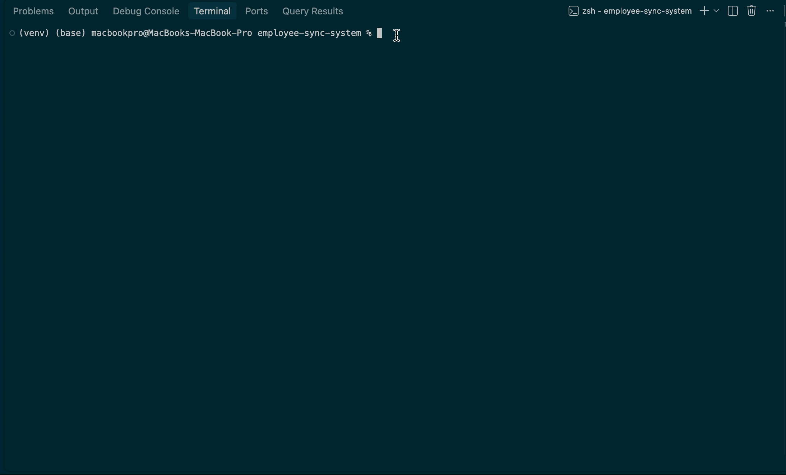
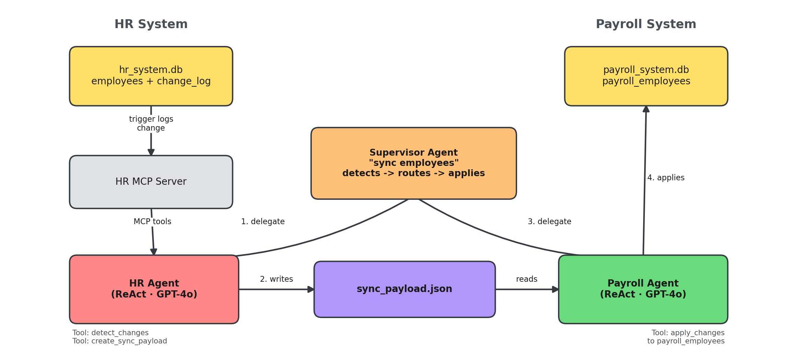

# change-detection-system

A proof-of-concept **multi-agent employee data sync system** built with **MCP (Model Context Protocol)**, **LangChain**, and **LangGraph**. It automatically detects changes made in an HR system and syncs them to a Payroll system — coordinated end-to-end by an LLM supervisor agent.



---

## What it does

1. **Detect** — a SQLite trigger on the HR database logs every insert/update to an employee record as an unprocessed "change."
2. **Package** — an HR agent (via an MCP server) reads the unprocessed changes and builds a sync payload.
3. **Apply** — a Payroll agent reads that payload and applies the changes to the payroll database.
4. **Orchestrate** — a supervisor agent sits above both, routing a single instruction ("sync employees") through the whole pipeline automatically.

**Example:** HR updates an employee's salary → the change is logged automatically → the HR agent detects it and creates a payload → the payroll agent applies it → the employee's next paycheck reflects the new salary. All from one command.

---

## Architecture



*Flow: an HR DB change fires a trigger → logged in `employee_change_log` → the Supervisor Agent delegates to the HR Agent, which detects changes via the HR MCP Server and writes `sync_payload.json` → the Payroll Agent reads it and applies the update to `payroll_system.db`.*

**Flow in one line:** `HR DB change → trigger → change_log → HR MCP server → HR agent → sync_payload.json → Payroll agent → Payroll DB`, all driven by a supervisor that can run the whole thing from a single instruction.

---

## Project structure

```
change-detection-system/
│
├── data/
│   ├── hr_system.db          # HR database (employees + employee_change_log)
│   ├── payroll_system.db     # Payroll database (payroll_employees + sync_log)
│   └── sync_payload.json     # Generated payload for transfer (gitignored)
│
├── scripts/
│   ├── init_hr_db.py         # Initialize HR database with sample data + triggers
│   ├── init_payroll_db.py    # Initialize Payroll database
│   └── add_update_employee.py  # Simulate an HR change (test utility)
│
├── hr_mcp_server.py          # MCP server exposing HR tools (detect_changes, create_sync_payload)
├── payroll_mcp_server.py     # MCP server exposing Payroll tools
├── hr_agent.py                # HR agent — detects changes, creates sync payload
├── payroll_agent.py           # Payroll agent — applies sync payload
├── orchestrator_agent_new.py  # Supervisor — runs the full pipeline from one command
│
├── .env.example
├── requirements.txt
└── README.md
```

---

## Setup

### 1. Create a virtual environment

```bash
python3 -m venv venv
source venv/bin/activate        # Windows: venv\Scripts\Activate.ps1
```

### 2. Install dependencies

```bash
pip install -r requirements.txt
```

### 3. Configure environment variables

Copy `.env.example` to `.env` and fill in your OpenAI API key:

```
OPENAI_API_KEY=sk-your-key-here
```

### 4. Initialize the databases

```bash
python scripts/init_hr_db.py
python scripts/init_payroll_db.py
```

---

## Running the demo

### Option A — one command (recommended)

Start the orchestrator, which spins up the HR MCP server itself and coordinates both agents:

```bash
python orchestrator_agent_new.py
```

Then type:

```
sync employees
```

This detects any pending HR changes, builds the payload, and applies it to payroll — all in one shot. You can also use:

- `check changes` — HR agent only, no payroll update
- `process payroll` — payroll agent only, applies whatever payload already exists
- `quit` — exit

### Option B — manual, step by step

**Terminal 1** — start the HR MCP server:
```bash
python hr_mcp_server.py
```

**Terminal 2** — simulate an HR change, then run the HR agent:
```bash
python scripts/add_update_employee.py   # edit this file first to set new values
python hr_agent.py                      # then type: check changes, create payload
```

**Terminal 2 (continued)** — apply the change to payroll:
```bash
python payroll_agent.py
```

---

## How change detection works

`employees` has two SQLite triggers:

- `employee_insert_trigger` — fires on every `INSERT`, logs it to `employee_change_log` as type `INSERT`.
- `employee_update_trigger` — fires on `UPDATE`, **only** when at least one tracked field actually changes (`WHEN OLD.<field> != NEW.<field>`). Setting a field to the same value it already had is a no-op and won't log anything.

`detect_changes` (HR MCP tool) reads all rows in `employee_change_log` where `processed = FALSE`. `create_sync_payload` builds `sync_payload.json` from those rows and marks them `processed = TRUE`.

---

## Notes / known limitations

- This is a **POC**, not production software — no auth, no retries, no idempotency guarantees beyond the `processed` flag.
- `scripts/add_update_employee.py` is a manual test harness standing in for a real HR application's write path — in production, any system writing to the `employees` table would trigger the same flow.
- `payroll_mcp_server.py` exists but isn't wired into the current agent flow — `payroll_agent.py` reads `sync_payload.json` directly rather than going through that MCP server.

---

## Tech stack

- **MCP** (`mcp` / FastMCP) — tool-serving protocol for the HR system
- **LangChain** + **LangGraph** — ReAct agents and the supervisor pattern (`langgraph-supervisor`)
- **OpenAI GPT-4o** — the LLM backing each agent
- **SQLite** — HR and payroll databases with triggers for change detection
